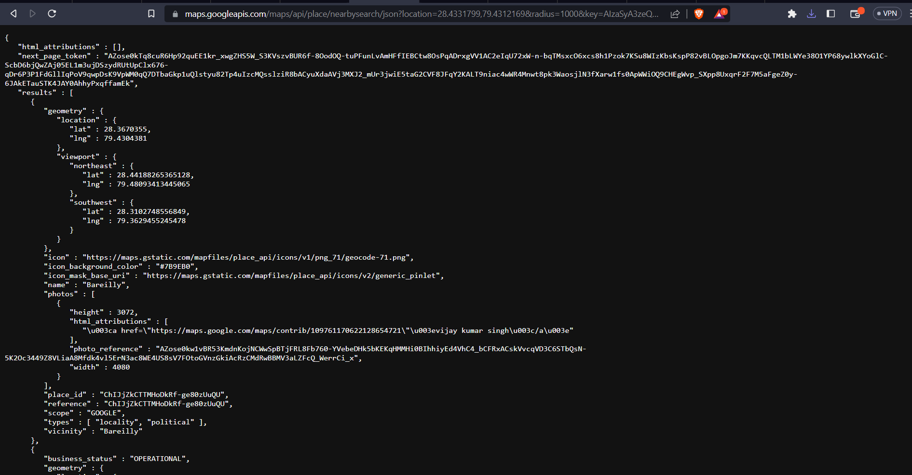

# Sniffout
# Live Location Sharing App with Google Maps API

The Live Location Sharing App is a powerful and user-friendly application that utilizes the Google Maps API to enable real-time location sharing, while providing an intuitive interface for users to interact with their surroundings. This app seamlessly integrates key features such as requesting location and GPS permissions, displaying live location updates, implementing the MVVM architecture pattern, utilizing LiveData, incorporating fragments, and leveraging Retrofit API for fetching nearby locations. 

## Key Features

- **Location Permission and GPS Access**: The app prompts users to grant location permissions and access to their device's GPS for accurate and up-to-date location tracking.

- **Real-Time Location Display**: Using the Google Maps API, the app provides a visually appealing and interactive map interface that shows the user's live location in real-time.

- **MVVM Architecture and LiveData**: The app follows the Model-View-ViewModel (MVVM) architectural pattern, separating the presentation logic from the data layer. LiveData is used to observe and update the UI with the latest location data.

- **Fragment Integration**: The app utilizes fragments to divide the user interface into modular components, enhancing code reusability, and providing a seamless user experience across various screen sizes and orientations.

- **Nearby Location Retrieval**: Leveraging the power of Retrofit API, the app fetches nearby locations based on the user's current location. This feature enables users to discover and explore places of interest in their vicinity.

## Usage

To run the app locally, follow these steps:

1. Clone the repository: `git clone https://github.com/your-username/your-repository.git`
2. Open the project in Android Studio.
3. Build and run the app on an emulator or a physical device.

## Contributing

Contributions are welcome! If you encounter any issues or have suggestions for improvements, please feel free to open an issue or submit a pull request.

